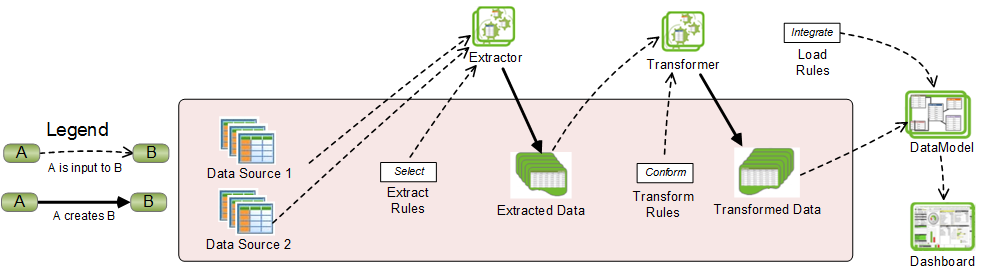

# TSEEQ (pronounced "seek"), The Structured ETL Engine for Qlik

## Latest Release == [3.1.1](https://github.com/qlikperf/TSEEQ/releases/latest)

## Documentation
Please read the TSEEQ **[documentation](http://eapowertools.github.io/GovernedMetricsService/)** for step-by-step instructions.

## Minimum Requirements:
QlikView 11 or QlikView 12; Qlik Sense 2.1 or higher (including all releases name after dates, for example, QlikSense June 2017 release).  TSEEQ works with both Desktop and Server product variants.

## Install
To install TSEEQ, first download the **[master ZIP file](https://s3.amazonaws.com/eapowertools/governedmetricsservice/bin/GovernedMetricsService.exe)**. Unzip that file, and follow instructions in the SEEQ Documentation.PDF.

## Description

# **_TSEEQ_** (pronounced “seek”), the Structured ETL Engine for Qlik
**_TSEEQ_** implements centralized management of Extract, Transform and Load (ETL) operations that provide data to QlikView and Qlik Sense applications.
Primary benefits of **_TSEEQ_** are:
· **Governance:** ETL operations are defined in externalized (and therefore readily manageable) rule sets.
· **Self-Service:** Business users may easily define and modify ETL operations in sandbox environments.
· **Performance:** A profiler enables efficient ETL execution.
· **Productivity:** A common code base promotes reuse and streamlines ETL development.
# 
# **_TSEEQ_** In Comparison to Traditional Embedded Scripting
The distinguishing characteristic of **_TSEEQ_** versus Traditional Embedding Scripting (**TES**) is that in **_TSEEQ_**, externalized rules (diagram above) provides a structured source of ETL control; in **TES**, free-form textual ETL script is embedded within Qlik application files (**QVWs** in QlikView and **QVFs** in Qlik Sense). We can conceptualize **TES** as shown in the diagram below:

Note: **_TSEEQ_** and **TES** are not mutually exclusive; a hybrid approach is useful in many cases.
**_TSEEQ_** test will be posting **_TSEEQ_** as a project on QlikBranch.

 

## License
**[MIT](https://github.com/eapowertools/GovernedMetricsService/blob/master/license)**

If you experience an issue, do not contact Qlik Support.  Please open an issue here: **[Issues](https://github.com/qlikperf/TSEEQ/issues)**
